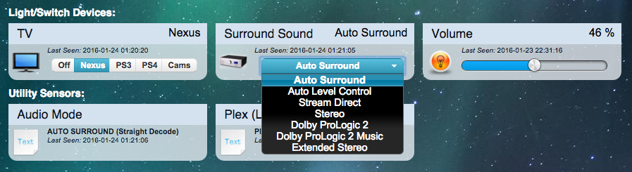
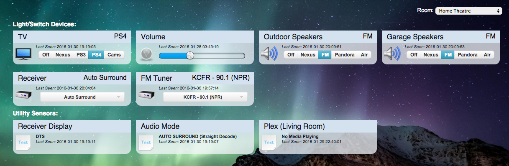

# Domoticz Home Theatre Controller
[]()
[]()
[]()

This is a NodeJS service interfaces with various Home Theatre hardware and Domoticz to provide a unified and extensable solution. 

## THIS IS BETA SOFTWARE AT THIS POINT!

My receiver is remotely located and not readially accessable, so everything needed to remotely manage a complex home theatre is built in.
Including support for the venerable PowerMate USB Knob made of high quality Aluminum.

At its most basic level it provides hardware support within Domticz for most modern Pioneer AVR's with command controll capability.
Along with a nice browser interface you get all the goodies that you need for Home Automation, such as scripting events/timers and other actions.

It connects with Domoticz via the MQTT JSON API, and your Pioneer AVR either with a persistent TCP or Serial connection.

> I have completely redone this project so its more portable and easier to adopt.

### Features:
* Power/Input Selector: React to and Change Audio/Video Sources
  * Multi-Zone Support: Select different sources for each of your zones.
* Mute/Volume Slider: React to and change volume output.
  * Multi-Zone Support: Controll each Zone's Volume independently.
* Listening Mode Selector: Change audio proccessors on the fly (Surround/Direct/Stereo/ProLogic/Extended/etc)
* FM Tune Selector: Change the FM Frequency on the Radio Tuner.
* Display Text: Monitor the display on your Pioneer Remotely.
* Audio Mode Text: Monitor the audio proccessor being used.
* PowerMate USB Volume Knob w/Status Indicator LED and multiple Gestures.
* Sharp Aquos RS232 TV Sync
* Default Volume reset on every input change
* Max Volume, prevent speaker damage.
* Very Fast, reacts instantly to changes and inputs.

### Install:
> presumes debian based linux and working domoticz, git, nodejs and npm.

1. Install MQTT Broker (apt-get install mosquitto)
2. Configure MQTT Hardware in Domoticz (Setup -> Hardware -> Type: MQTT Client Gateway)
3. Create Dummy Hardware in Domoticz called "HTC"
4. Add Dummy Selector Switch: Inputs
  * Configure Levels as Inputs (see screenshots)
5. Add Dummy Selector Switch: Modes
  * Configure Levels as Modes (see screenshots)
6. Repeat adding what ever switches you need, use Text Sensors for Display/Mode Display
7. Get Switch IDX from Domoticz and Configure HTC to match (Setup -> Devices -> Search)
  * Download and Configure with:
```bash
git clone https://github.com/nayrnet/domoticz-htc.git htc
cd htc
npm install
cp config.example config.js
nano config.js
// Edit aproprately, save.
```

### Update:
```bash
git pull
./daemon.js stop
./daemon.js start
```

### My Hardware:
* Pioneer SC-1222-K
  * AndroidTV -  Nexus Player w/Ethernet OTG
    * Plex
    * Netflix
    * Pandora
    * AndroidTV OSD Remote
    * HDHomeRun CONNECT
  * Sony PlayStation 3
  * Sony PlayStation 4
  * Mini Super NVR (Display Only, no storage)
* Sharp Aquos LC-C3242U
* Griffin PowerMate NA16029

### Software:
* AVR Controller - ME!
* Domoticz - http://www.domoticz.com
* Debian Jessie w/NodeJS from NodeSource repository
* AndroidTV OSD Remote - https://github.com/nayrnet/androidtv-osd-remote
* Mosquitto MQTT Broker

### Domoticz Devices:
* Input Selector - Change Video Inputs and Toggle Power
* Audio Mode Selector - Change the audio proccessor.
* Volume Slider - Toggle Mute and set volume level.
* Display - Text Sensor showing the front display.
* Audio Mode - Show current audio proccessor (may not always be the one you select).

### PowerMate Functions: 
* Left/Right = Vol Down/Vol Up
* Quick tap = Mute toggle
* Double tap = Change to Nexus Input, power on if needed.
* Long hold = Power off
* Down and Left = Dim Living Room Lights.
* Down and Right = Brighten Living Room Lights.
* LED Pulse on Power/Input change, On/Off with TV & AVR.

### Files:
* config.js - Main configuration, use provided example.. not overwritten on update.
* server.js - The main app, if debugging you can run this directly from command line.
* daemon.js - This is app forks the daemon and starts/stops the server.
* hardware/pioneeravr.js - Functions for AVR Commands.
* hardware/sharptv.js - Functions for TV Commands.
* screenshots/ - Images of Domoticz & Setup
* systemd/avrcontroller.service - SystemD Service for Starting/Restarting.

### Credits:
* My Pioneer-AVR Starting point: https://github.com/stormboy/node-pioneer-avr/blob/master/pioneer-avr.js
* My PowerMate Starting point: https://github.com/mattwelch/sonospowermate/blob/master/sonospowermate.js

### Web Screenshot:
Basic Selector Switch:



Multi Zone w/Tuner


#### TO-DO:
* Volume Slider in Domoticz
* Add support for ZONE3/ZONE4
* Release

### Pioneer Setup Prefrences:
* 055SUC  - Set Power ON Level to 055
* 3SUD - Set Volume Limit to 0dB (161)

#### Support:
> No support provided or warranty impied, this project is avilable for educational use and my own personal tracking.
