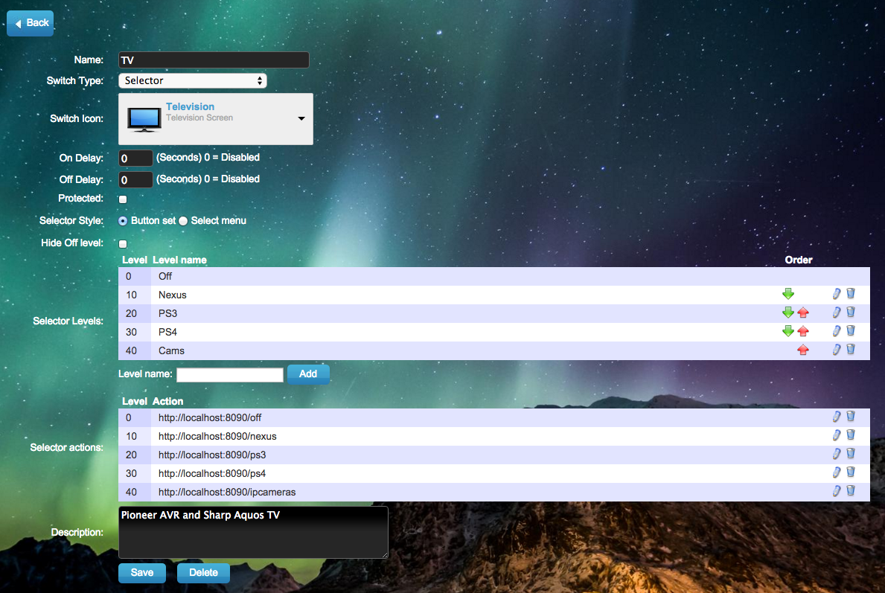

# AVR Controller

This Node app communicates with my tv via rs232 and with my audio reciever via TCP-Socket. Volume/Mute/Power/Default input are all provided by a PowerMate USB Knob.

This relieves me of a universal remote, each device has its own controller and the PowerMate provides the missing functionality. The Nexus player is the default device and it has an OSD remote to provide input changes and other functions.
Now I have one remote, the Nexus Remote and that along with the PowerMate can controll everything needed, then the game systems have there own controllers. There is no longer a need for a second remote to controll the AVR/Power/Volume/Lights..

Also provides me with remote controll through Web browser through a Domoticz Virtural Selector Switch.

### Hardware:
* Pioneer SC-1222-K
  * Google Nexus Player
  * Sony PlayStation 3
  * Sony PlayStation 4
  * Mini Super NVR (Display Only, no storage)
* Sharp Aquos LC-C3242U
* Griffin PowerMate NA16029

### Software:
* AVR Controller - ME!
* Domoticz WebUI - http://www.domoticz.com
* Debian Jessie w/NodeJS from NodeSource repos
* AndroidTV OSD Remote - https://github.com/nayrnet/androidtv-osd-remote

### PowerMate Functions: 
* Left/Right = Vol Down/Vol Up
* Quick tap = Mute toggle
* Double tap = Change to Nexus Input, power on if needed.
* Long hold = Power off
* Down and Left = Dim Living Room Lights.
* Down and Right = Brighten Living Room Lights.

> Out of the box this solution is going to do very little for you, its very specific to my setup. However the code is free to copy and modify for your own uses.

### Credits:
* My Pioneer-AVR Starting point: https://github.com/stormboy/node-pioneer-avr/blob/master/pioneer-avr.js

### Web Screenshot:
Selector Switch:

Switch Config:

